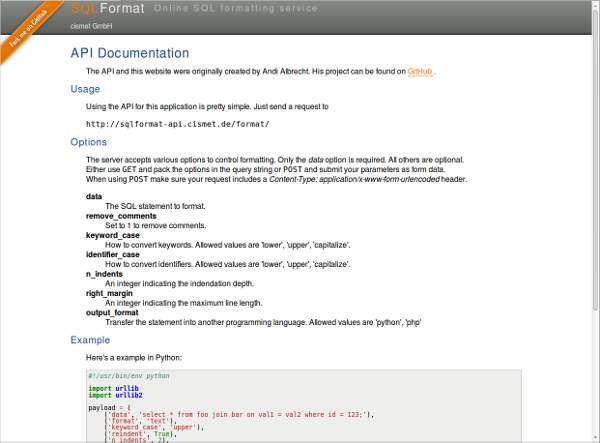

sqlparse-flask-webservice
=========================

A webservice written with the framework Flask for the sqlparse python module

Acknowledgment
--------------

This webservice was originally created by Andi Albrecht, the original can be found in his project [sqlparse](https://github.com/andialbrecht/sqlparse).
It should be mentioned that sqlparse's focus is not on the webservice, but on formatting SQL queries.
Therefore this is not a fork of sqlparse, as the focus of this project lies on the webservice.

Webservice
----------

A running instance of this webservice can be found at http://sqlformat-api.cismet.de/, it also contains
the documentation of the API.

That instance uses a [fork](https://github.com/helllth/sqlparse) of Andi Albrecht's sqlparse.

License
=======

Andy Albrecht's sqlparse was released under the terms of the [New BSD License](opensource.org/licenses/bsd-license.php).
We will choose an apprioriate licence for this project, according to the New BSD License.
